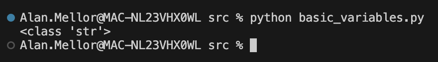

# Basic Variables

> Code for this section [here](src/basic_variables.py)

Python has a simple syntax to allow us to create a variable:

```python
  first_name = "Alan"
```

We have a variable named `first_name` and it is initialised to the string value `"Alan"`.

You'll notice the simplicity here:

- no explicit data type specified
- no keyword like `const` or `var`.

Python uses just the name, an assignment operator = and the value to assign. Simples.

## Naming rules

Python enforces these rules on variable names:

- Must begin with a letter or underscore
- Must not begin with a number
- Only alphanumerics (A-z 0-9) and the underscore allowed
- Must not be a Python [reserved word](https://docs.python.org/3/reference/lexical_analysis.html#keywords)

Note names are case sensitive so `Price` and `price` are unrelated variables to Python.

> Idiomatic python uses `lower_snake_case` for identifier names.

### Good names

It's also a good Software Engineering idea to name variables after the information they store:

- first_name
- total_price
- customer_friendly_name

Avoid misleading or nondescript names.

## Built-in primitive data types

While we didn't _specify_ a datatype, that doesn't mean there isn't one!

```python
  first_name = "Alan"
  print(typeof(first_name))
```

shows output:



Our variable first*name has a data type that was \_inferred* by Python: `str`, for string.

Python supports other built-in data tyes, known as _primitives_:

- `int` - integer numbers. Integers can be arbitrarily large
- `float` - floating point numbers
- `complex` - _not required for this course_ - complex numbers (for example 2 +3i)
- `bool` - boolean TRUE|FALSE type
- `NoneType` - signals the absence of any data type

You can run some examples at [src/basic-variables.py](src/basic-variables.py)

### Built in binary data types

Python has types allowing individual bytes of memory to be represented:

- `bytes`
- `bytearray`
- `memoryview`

These are of no immediate interest to our Data Engineering Spark training.

## Dynamic typing

What happens when we run this code, and what does it tell us?

```python
dynamic_type = "dogbanana"
print(type(dynamic_type), dynamic_type)

dynamic_type = 11
print(type(dynamic_type), dynamic_type)

dynamic_type = dynamic_type / 2
print(type(dynamic_type), dynamic_type)
```

We see the following output. Notice the type of the variable `dynamicType` in each case:

```bash
<class 'str'> dogbanana
<class 'int'> 11
<class 'float'> 5.5
```

We can see that the variable can have its value varied (of course!) but that it can also have its _data type changed_.

This is known as _dynamic typing_.

Python is a _strongly typed, dynamically typed_ programming language.

This differs from strong, static typed languages such as Go, Java, C++ and C#. In those languages, you cannot change data type after it has been defined. In Python you can, and this changes some Python idioms (_pythonic_ code) available to you.

Different approaches to typing are swings and roundabouts, really. Static and dynamic typed languages have opposing strnegths and weaknesses. You win some, you lose some.

## Casting

A _cast_ is when we take one data type and convert it into another. This is required in strongly typed languages. As one example, the text string `"26"` and the integer `26` are completely unrelated in a strongly typed language.

Python allows us to explicitly change type using a cast:

```python
  quantity_as_text = "26"
  quantity = int(quantity_as_text) # type of `quantity` is integer
```

Python will raise an `Error` if the type conversion cannot be done.

## Decimal

To get around some limits of floating point types (see Further reading), we can use the Decimal type. This is supported by the [Decimal module](https://docs.python.org/3/library/decimal.html):

```python
from decimal import *

a = Decimal(1)
b = Decimal(7)
result = a/b
print(result)
```

The `Decimal` data type allows

- unlimited size and precision
- fine control of rounding behaviour
- number of decimal places

It is particularly useful for _money_ amounts.

## Fraction

The Fraction type enables working with fractions as actual fractions.

Fractions are one of those neat ideas that are brilliant when you need them.

Docs: https://docs.python.org/3/library/fractions.html

_not required for this course_

## Working with strings

Python supports both single and double quotes, so you can easily mix and match quotes-inside-quotes:

```python
single_quoted = "Hello 'Alan' - if that's your real name!"
double_quoted = 'Hello "Alan" - if you are really called that!'
```

Multiline strings are very useful:

```python
many_lines = """I mean,
just how
many lines of text
do you
really need?
"""

print(many_lines)
```

### Slicing strings

Slicing is a powerful feature allowing a string to be divided up:

```python
source = "A stitch in time saves a mixed metaphor"

first_ten = source[:10]
print(first_ten)

all_after_tenth = source[10:]
print(all_after_tenth)

middle = source[10:15]
print(middle)
```

resulting in output:

```text
A stitch i
n time saves a mixed metaphor
n tim
```

Negative slice indices will work. They go backwards from the end of the string:

```python
from_the_end =  source[-5:-2]
print(from_the_end)
```

resulting in

```text
aph
```

Very useful for manipulating text data.

### String concatenation

```python
start = "Can we join it? "
end = "yes we can!"
result = start + end
print(result)
```

### F strings - variable replacement

Strings can have placeholder symbols inside them, and have the placeholder replaced at runtime:

```python
item = "bananadog"
template = f"Blimey! I did not expect to see a {item}!"
print(template)
```

Showing:

```text
Blimey! I did not expect to see a bananadog!
```

### Operations on strings

Strings are objects in Python, and that means we can call methods on them using the dot notation. Strings have many useful methods:

```python
original = "i wish i was in upper case!"
result = original.upper()
print(result)
```

Which converts the text to all capitals.

For other string methods, see the docs at:
https://docs.python.org/3/library/stdtypes.html#string-methods

## Working with dates

Dates are tricky beasts, and with timezones they are doubly so.

Python has useful objects for working with dates:

- `datetime`
- `date`
- `time`
- `timedelta`
- `timezone`

Python describes time information as either _aware_ or _naive_.

- Aware fully defines an unambiguous moment
- Naive uses a definition which bakes-in an assumption, eg about timezone

Supporting these representations are two useful functions `strftime()` and `strptime()` which allow text format conversions to popular date formats.

Example showing some date manipulation features in action:

```python
from datetime import date

today = date.today()

my_birthday = date(2001, 12, 31)
days_old = abs(today-my_birthday)
print(f"I am {days_old.days} days old today")
```

Python date handling covers much more than this. See the docs here:

https://docs.python.org/3/library/datetime.html#

# Further reading

There are some issues with computers storing binary values and accurately representing decimal numbers. The Python docs covers such issues well:

https://docs.python.org/3/tutorial/floatingpoint.html

You'll sometimes come across such inaccuracies in Data Engineering. It's worth knowing where to look for more information.

# Next

[Making decisions with conditionals](/02-conditionals.md)

[Back to contents](/contents.md)
